# 💍 Weddy — 당신의 완벽한 결혼 준비 파트너

> 커플이 함께 결혼 준비를 체계적으로 관리할 수 있는 모바일 앱

[](https://flutter.dev)
[](https://spring.io/projects/spring-boot)
[](https://openjdk.org)
[](https://mysql.com)

---

## 📱 화면 미리보기

<table>
  <tr>
    <td align="center"><b>로그인</b></td>
    <td align="center"><b>회원가입</b></td>
    <td align="center"><b>예식일 설정</b></td>
  </tr>
  <tr>
    <td>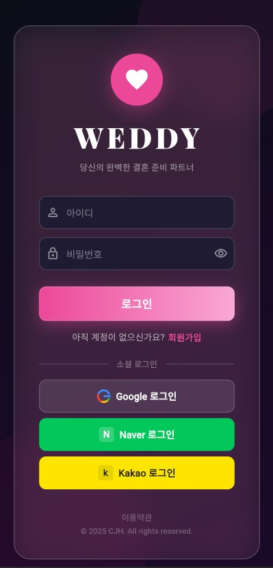</td>
    <td>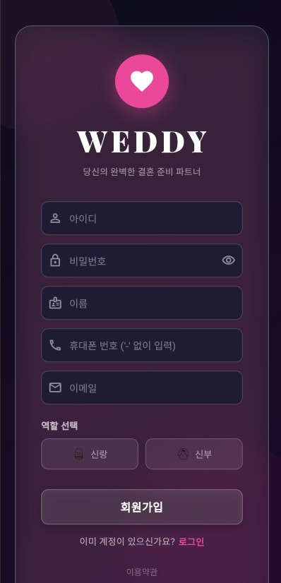</td>
    <td>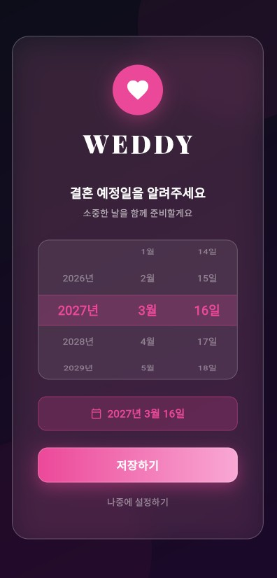</td>
  </tr>
</table>

<table>
  <tr>
    <td align="center"><b>홈화면 - 1</b></td>
    <td align="center"><b>홈화면 - 2</b></td>
    <td align="center"><b>홈화면 - 3</b></td>
    <td align="center"><b>홈화면 - 4</b></td>
  </tr>
  <tr>
    <td>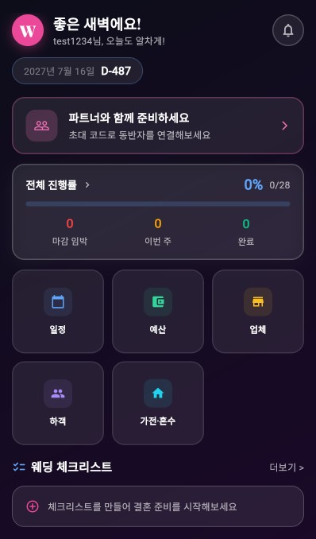</td>
    <td>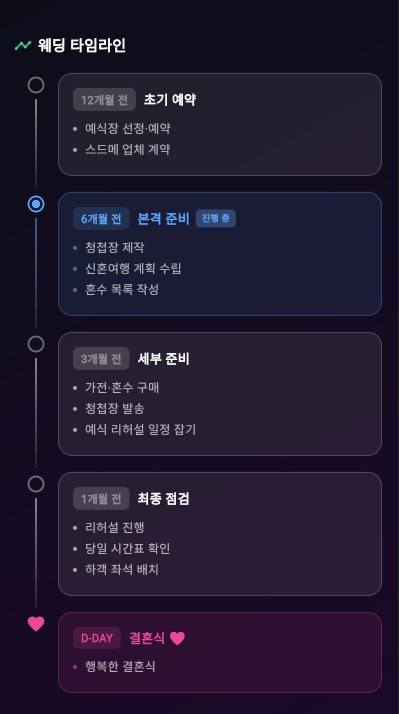</td>
    <td>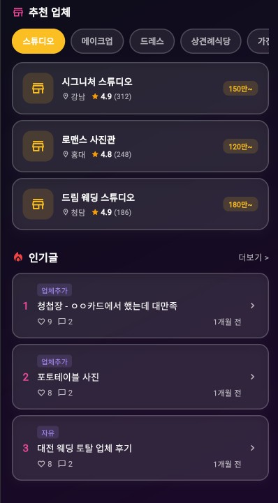</td>
    <td>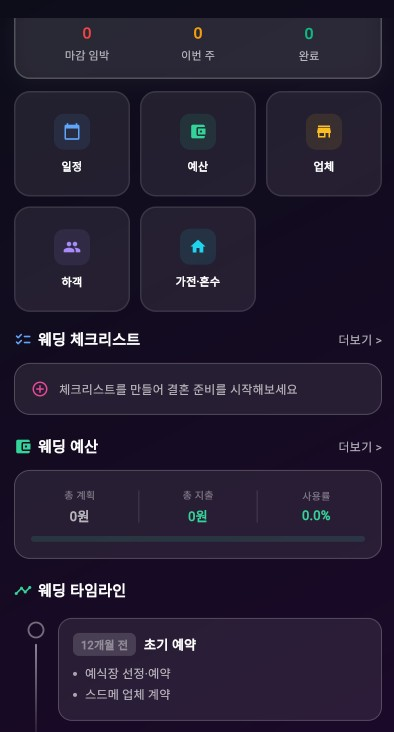</td>
  </tr>
</table>

<table>
  <tr>
    <td align="center"><b>예산 - 등록 전</b></td>
    <td align="center"><b>예산 - 전체 예산 등록</b></td>
    <td align="center"><b>예산 - 등록 후</b></td>
    <td align="center"><b>예산 - 카테고리별 등록</b></td>
    <td align="center"><b>예산 - 지출 항목 등록</b></td>
    <td align="center"><b>예산 - 진행률 반영</b></td>
  </tr>
  <tr>
    <td>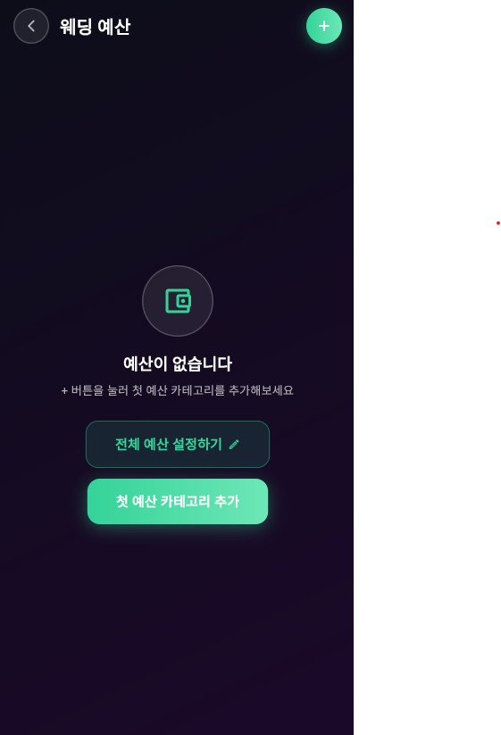</td>
    <td></td>
    <td></td>
    <td>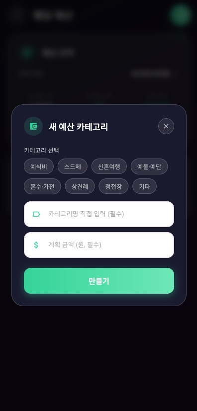</td>
    <td>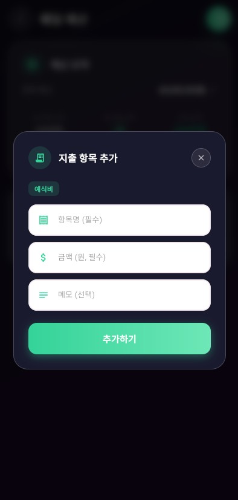</td>
    <td>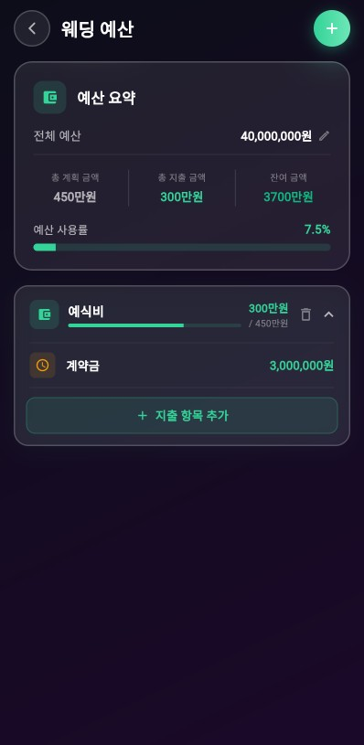</td>
  </tr>
</table>

<table>
  <tr>
    <td align="center"><b>업체찾기 - 조회</b></td>
    <td align="center"><b>업체찾기 - 상세조회</b></td>
    <td align="center"><b>업체찾기 - 즐겨찾기</b></td>
  </tr>
  <tr>
    <td>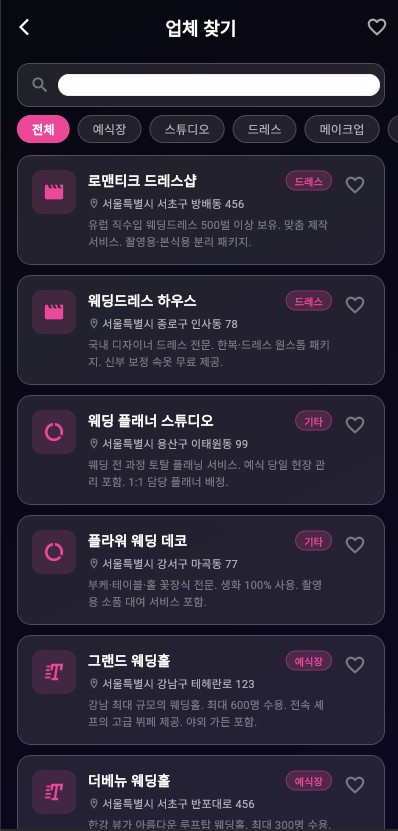</td>
    <td>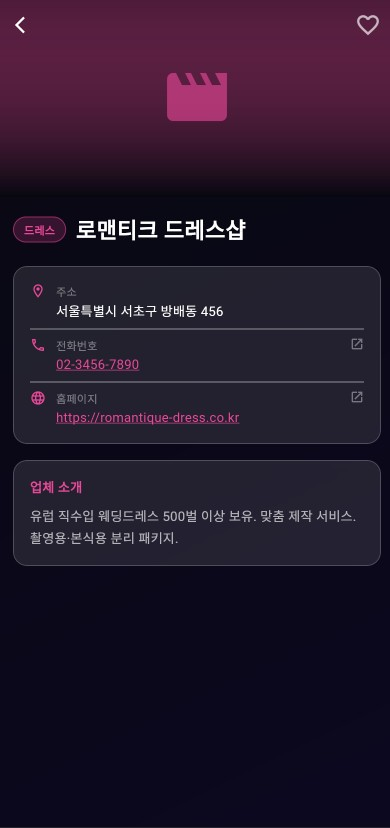</td>
    <td></td>
  </tr>
</table>

<table>
  <tr>
    <td align="center"><b>웨딩관리 - 조회</b></td>
    <td align="center"><b>웨딩관리 - 로드맵 추가</b></td>
    <td align="center"><b>웨딩관리 - 웨딩홀 투어 및 예약</b></td>
    <td align="center"><b>웨딩관리 - 웨딩 예산 설정</b></td>
  </tr>
  <tr>
    <td>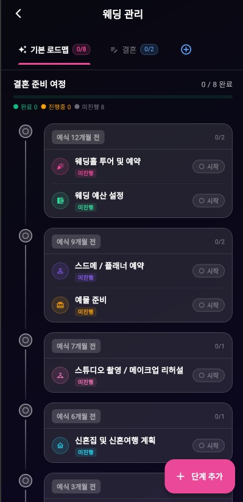</td>
    <td>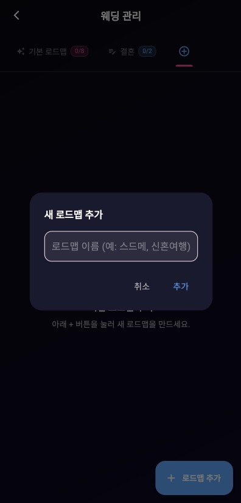</td>
    <td>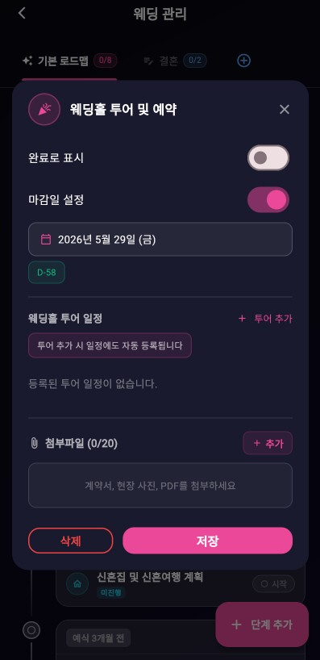</td>
    <td>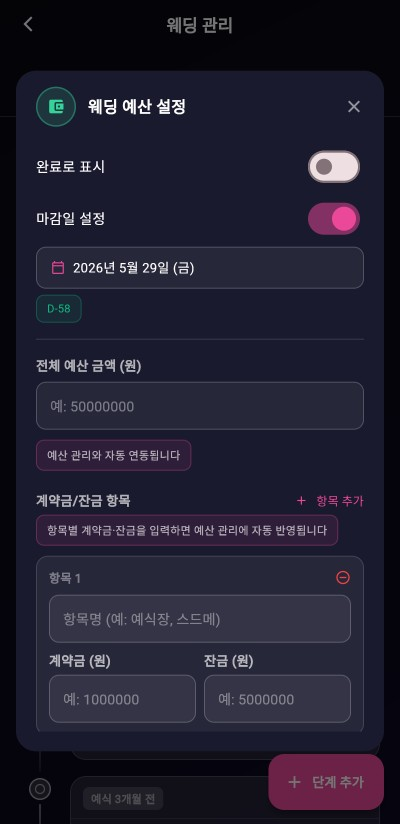</td>
  </tr>
</table>

<table>
  <tr>
    <td align="center"><b>웨딩관리 - 예물 준비</b></td>
    <td align="center"><b>웨딩관리 - 스드메/플래너 예약</b></td>
    <td align="center"><b>웨딩관리 - 신혼집 및 신혼여행 계약</b></td>
    <td align="center"><b>웨딩관리 - 로드맵 직접 등록 단계</b></td>
  </tr>
  <tr>
    <td>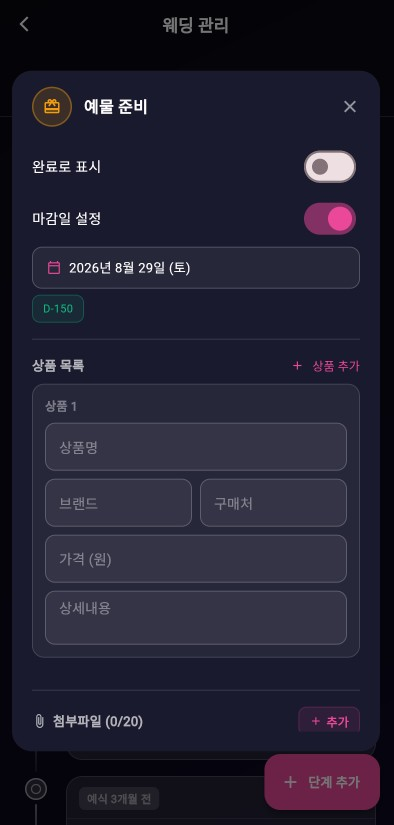</td>
    <td>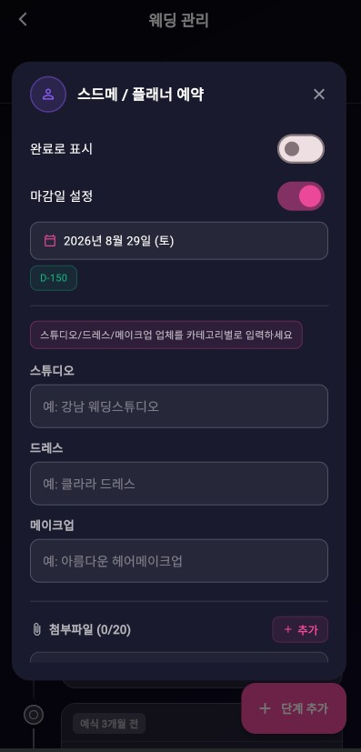</td>
    <td>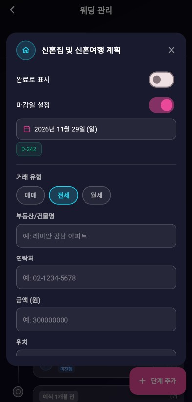</td>
    <td>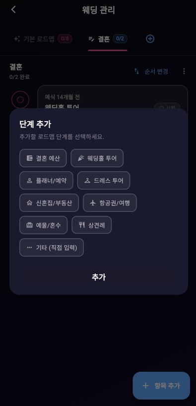</td>
  </tr>
</table>

<table>
  <tr>
    <td align="center"><b>일정관리 - 월간조회</b></td>
    <td align="center"><b>일정관리 - 주간조회</b></td>
    <td align="center"><b>일정관리 - 일별조회</b></td>
    <td align="center"><b>일정관리 - 일정등록</b></td>
  </tr>
  <tr>
    <td>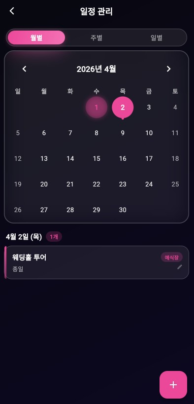</td>
    <td>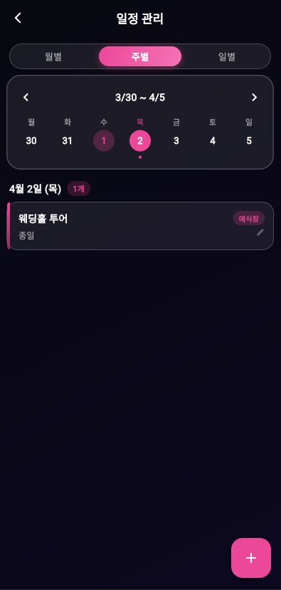</td>
    <td>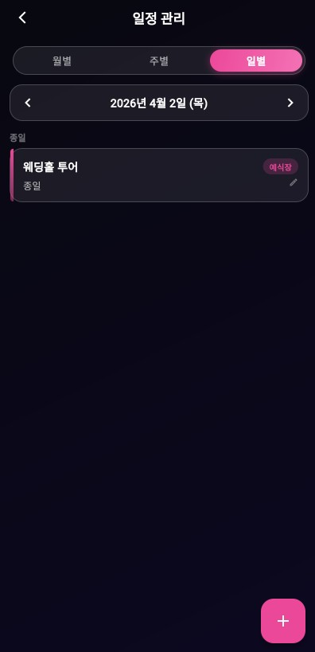</td>
    <td>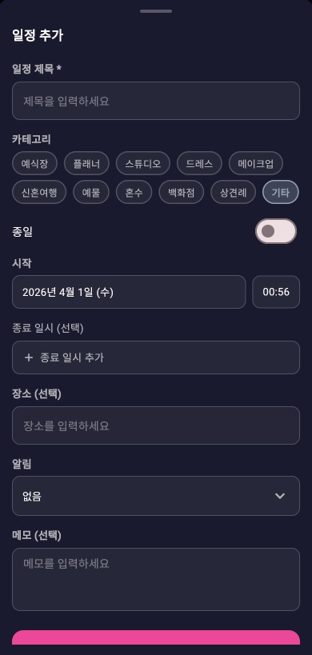</td>
  </tr>
</table>

<table>
  <tr>
    <td align="center"><b>웨딩체크리스트 - 최초화면</b></td>
    <td align="center"><b>웨딩체크리스트 - 등록</b></td>
    <td align="center"><b>웨딩체크리스트 - 조회</b></td>
    <td align="center"><b>웨딩체크리스트 - 삭제</b></td>
  </tr>
  <tr>
    <td></td>
    <td>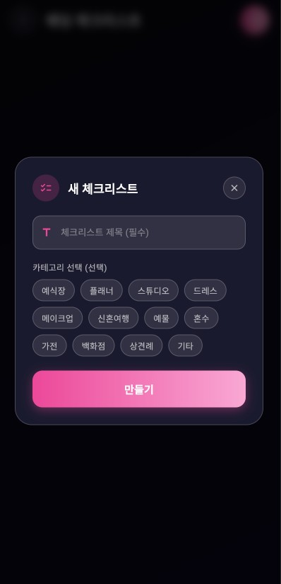</td>
    <td></td>
    <td>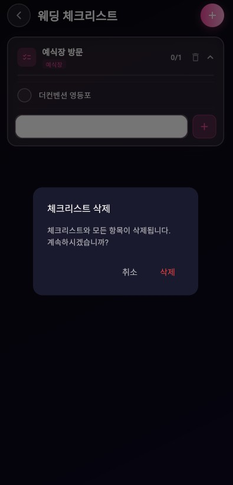</td>
  </tr>
</table>

<table>
  <tr>
    <td align="center"><b>하객관리 - 조회</b></td>
    <td align="center"><b>하객관리 - 등록</b></td>
    <td align="center"><b>개발진행중...</b></td>
  </tr>
  <tr>
    <td>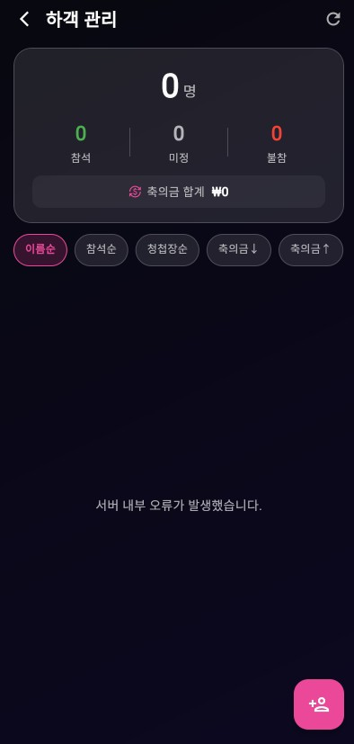</td>
    <td>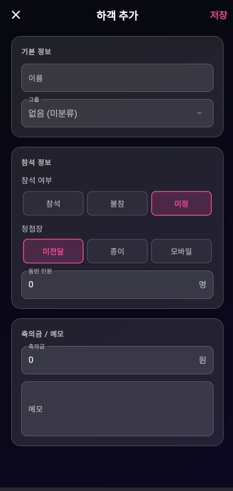</td>
    <td>개발진행중...</td>
  </tr>
</table>


---

## ✨ 주요 기능

| 기능 | 설명 | 상태 |
|------|------|------|
| 회원가입 · 로그인 | ID/PW 인증, JWT AccessToken + RefreshToken | ✅ 완료 |
| 소셜 로그인 | Google · Naver · Kakao | 🔜 예정 |
| 결혼 예정일 설정 | 로그인 후 D-DAY 카운트다운 설정 | ✅ 완료 |
| 커플 연결 | 6자리 초대코드로 파트너와 계정 연동 | ✅ 완료 |
| 웨딩 체크리스트 | 카테고리별 항목 관리, 완료 토글, 홈 미리보기 | ✅ 완료 |
| 예산 관리 | 카테고리별 예산 계획 및 지출 내역 관리, 초과율 표시 | ✅ 완료 |
| 일정 관리 | 월별·주별·일별 캘린더, 카테고리 색상 마커, 알림 설정 | ✅ 완료 |
| 웨딩 관리 | 결혼 준비 9단계 로드맵, 웨딩홀 투어, 예산/일정 자동 연동 | ✅ 완료 |
| 즐겨찾기 · 업체 검색 | 스튜디오·드레스·메이크업 등 웨딩 업체 관리 | 🔜 예정 |
| 하객 관리 | 하객 목록 및 좌석 배치 | 🔜 예정 |

---

## 🛠 기술 스택

### Backend
- **Framework**: Spring Boot 3.2.3 (Java 17)
- **보안**: Spring Security + JWT (jjwt 0.12.3), BCrypt(strength=12)
- **Rate Limiting**: IP 기반 분당 10회 제한
- **DB**: MySQL 8.x (FK 없음 — 참조 무결성은 Service 레이어 관리)
- **ORM**: Spring Data JPA (Hibernate)
- **빌드**: Gradle

### Frontend
- **Framework**: Flutter (Dart ^3.5.4)
- **상태 관리**: Flutter Riverpod 2.x (sealed state pattern)
- **HTTP**: Dio (인터셉터 기반 자동 토큰 갱신)
- **라우팅**: go_router
- **토큰 저장**: flutter_secure_storage (네이티브) / localStorage (웹)
- **캘린더**: table_calendar ^3.1.2
- **환경 설정**: flutter_dotenv
- **폰트**: google_fonts (Playfair Display)
- **디자인**: Dark Glassmorphism (`#0D0D1A → #1B0929`, BackdropFilter blur:20)

---

## 📁 프로젝트 구조

```
weddy/
├── weddy-backend-1.0/weddy/
│   └── src/main/java/com/project/weddy/
│       ├── common/
│       │   ├── response/       # ApiResponse 공통 응답
│       │   ├── exception/      # GlobalExceptionHandler, ErrorCode
│       │   ├── security/       # JWT, SecurityConfig, RateLimitFilter
│       │   ├── util/           # OidGenerator (SecureRandom 14자리)
│       │   └── init/           # DataInitializer (@Profile("dev"))
│       └── domain/
│           ├── user/           # 인증 (회원가입, 로그인, 토큰 갱신)
│           ├── couple/         # 커플 연결 (초대코드)
│           ├── checklist/      # 체크리스트 CRUD
│           ├── budget/         # 예산 관리 (카테고리·항목·설정)
│           ├── schedule/       # 일정 관리
│           ├── roadmap/        # 웨딩 관리 (로드맵·투어·경유지)
│           └── vendor/         # 업체 정보
│
└── weddy-frontend-1.0/weddy/
    └── lib/
        ├── core/
        │   ├── network/        # DioClient, ApiResponse, ApiException
        │   ├── storage/        # TokenStorage (Web/Native 분기)
        │   └── router/         # AppRouter (go_router)
        └── features/
            ├── auth/           # 로그인, 회원가입, AuthNotifier
            ├── home/           # 홈 화면 (요약 카드 6종)
            ├── couple/         # 커플 연결 화면
            ├── checklist/      # 체크리스트 화면
            ├── budget/         # 예산 관리 화면
            ├── schedule/       # 일정 관리 화면 (월별/주별/일별)
            └── roadmap/        # 웨딩 관리 화면 (9단계 로드맵)
```

---

## 🗃 DB 설계 원칙

- **PK**: auto-increment 금지 → `SecureRandom` 14자리 숫자 문자열 (`oid`)
- **FK**: 전부 제거 → 관계 컬럼에 `INDEX`만 부여, 참조 무결성은 Service 트랜잭션으로 관리
- **테이블 접두사**: `weddy_`
- **문자셋**: 전 테이블 `utf8mb4_unicode_ci` 통일
- **솔로/커플 공용**: `owner_oid` 필드 — 커플 연결 시 `coupleOid`, 미연결 시 `userOid`

### 테이블 목록

| 테이블 | 설명 |
|--------|------|
| `weddy_users` | 사용자 |
| `weddy_refresh_tokens` | Refresh Token (DB Rotation) |
| `weddy_couples` | 커플 연결 정보 |
| `weddy_checklists` | 체크리스트 카테고리 |
| `weddy_checklist_items` | 체크리스트 항목 |
| `weddy_budgets` | 예산 카테고리 |
| `weddy_budget_items` | 예산 지출 항목 |
| `weddy_budget_settings` | 전체 예산 설정 |
| `weddy_schedules` | 일정 |
| `weddy_roadmap_steps` | 웨딩 관리 단계 |
| `weddy_roadmap_hall_tours` | 웨딩홀 투어 |
| `weddy_roadmap_travel_stops` | 신혼여행 경유지 |
| `weddy_vendors` | 웨딩 업체 |

---

## 🚀 시작하기

### 사전 요구사항

- Java 17+
- MySQL 8.x
- Flutter SDK 3.x (Dart ^3.5.4)

### Backend 실행

```bash
cd weddy-backend-1.0/weddy

# 1. DB 초기화 (MySQL 클라이언트)
source scripts/schema.sql
source scripts/data.sql

# 2. 개발 서버 실행
./gradlew bootRun --args='--spring.profiles.active=dev'
```

> `application-dev.yml` 기준: DB `weddy/weddy01`, `show-sql=true`, DEBUG 로그

### Frontend 실행

```bash
cd weddy-frontend-1.0/weddy

# .env 파일 생성
echo "API_BASE_URL=http://10.0.2.2:8080/api/v1" > .env

# 의존성 설치 및 실행
flutter pub get
flutter run
```

---

## 🔑 테스트 계정 (dev 환경 자동 생성)

| 아이디 | 비밀번호 | 역할 | 상태 |
|--------|----------|------|------|
| `groom_kim` | `1234` | 신랑 | 커플 연결됨 |
| `bride_lee` | `1234` | 신부 | 커플 연결됨 |
| `solo_park` | `1234` | 신부 | 솔로 (미연결) |

> 커플 초대코드: `groom_kim` → `WED-GRM001` / `bride_lee` → `WED-BRD001`

---

## 📡 API 엔드포인트

### 인증

| 메서드 | 경로 | 설명 |
|--------|------|------|
| POST | `/api/v1/auth/signup` | 회원가입 |
| POST | `/api/v1/auth/login` | 로그인 |
| POST | `/api/v1/auth/refresh` | 토큰 갱신 |
| POST | `/api/v1/auth/logout` | 로그아웃 |
| GET | `/api/v1/users/me` | 내 정보 조회 |
| PATCH | `/api/v1/users/me/wedding-date` | 결혼 예정일 설정 |

### 커플

| 메서드 | 경로 | 설명 |
|--------|------|------|
| POST | `/api/v1/couples/connect` | 커플 연결 (초대코드) |
| GET | `/api/v1/couples/me` | 커플 정보 조회 |
| DELETE | `/api/v1/couples/me` | 커플 해제 |

### 체크리스트

| 메서드 | 경로 | 설명 |
|--------|------|------|
| GET | `/api/v1/checklists` | 전체 조회 |
| POST | `/api/v1/checklists` | 카테고리 생성 |
| DELETE | `/api/v1/checklists/{oid}` | 카테고리 삭제 |
| POST | `/api/v1/checklists/{oid}/items` | 항목 추가 |
| PATCH | `/api/v1/checklists/{oid}/items/{itemOid}` | 항목 수정 (완료 토글 포함) |
| DELETE | `/api/v1/checklists/{oid}/items/{itemOid}` | 항목 삭제 |
| GET | `/api/v1/checklists/home-preview` | 홈 미리보기 (최대 3개) |

### 예산

| 메서드 | 경로 | 설명 |
|--------|------|------|
| GET | `/api/v1/budgets` | 카테고리 목록 조회 |
| POST | `/api/v1/budgets` | 카테고리 생성 |
| DELETE | `/api/v1/budgets/{oid}` | 카테고리 삭제 |
| POST | `/api/v1/budgets/{oid}/items` | 지출 항목 추가 |
| PUT | `/api/v1/budgets/{oid}/items/{itemOid}` | 지출 항목 수정 |
| DELETE | `/api/v1/budgets/{oid}/items/{itemOid}` | 지출 항목 삭제 |
| GET | `/api/v1/budgets/summary` | 예산 요약 (usageRate, totalPlanned 등) |
| GET | `/api/v1/budgets/settings` | 전체 예산 설정 조회 |
| PUT | `/api/v1/budgets/settings` | 전체 예산 설정 (upsert) |

### 일정

| 메서드 | 경로 | 설명 |
|--------|------|------|
| GET | `/api/v1/schedules` | 일정 조회 (year, month 파라미터, 미지정 시 전체) |
| POST | `/api/v1/schedules` | 일정 생성 |
| GET | `/api/v1/schedules/{oid}` | 단건 조회 |
| PUT | `/api/v1/schedules/{oid}` | 일정 수정 |
| DELETE | `/api/v1/schedules/{oid}` | 일정 삭제 |

### 웨딩 관리 (로드맵)

| 메서드 | 경로 | 설명 |
|--------|------|------|
| GET | `/api/v1/roadmap` | 전체 단계 조회 |
| POST | `/api/v1/roadmap` | 단계 생성 (최대 20개) |
| GET | `/api/v1/roadmap/{oid}` | 단건 조회 |
| PUT | `/api/v1/roadmap/{oid}` | 단계 수정 |
| PATCH | `/api/v1/roadmap/{oid}/toggle` | 완료 토글 |
| DELETE | `/api/v1/roadmap/{oid}` | 단계 삭제 (연관 일정·투어 연쇄 삭제) |
| GET | `/api/v1/roadmap/{oid}/hall-tours` | 웨딩홀 투어 목록 |
| POST | `/api/v1/roadmap/{oid}/hall-tours` | 투어 추가 (일정 자동 등록) |
| DELETE | `/api/v1/roadmap/{oid}/hall-tours/{tourOid}` | 투어 삭제 |
| POST | `/api/v1/roadmap/{oid}/travel-stops` | 신혼여행 경유지 추가 |
| DELETE | `/api/v1/roadmap/{oid}/travel-stops/{stopOid}` | 경유지 삭제 |

> 모든 API 응답 형식: `{ "success": true/false, "message": "...", "data": {...}, "errorCode": null }`

---

## 🔗 주요 연동 로직

### 일정 자동 등록
웨딩 관리(로드맵)에서 마감일을 설정하면 일정이 자동으로 등록됩니다.

| 트리거 | 생성되는 일정 |
|--------|--------------|
| 로드맵 단계 `dueDate` 설정 | `sourceType=ROADMAP`, 카테고리 자동 매핑 |
| 웨딩홀 투어 `tourDate` 입력 | `sourceType=HALL_TOUR`, 카테고리=예식장 |
| 단계/투어 삭제 | 연관 일정 자동 삭제 |

### stepType → 일정 카테고리 매핑

| stepType | 일정 카테고리 |
|----------|--------------|
| HALL | 예식장 |
| PLANNER | 플래너 |
| DRESS | 드레스 |
| TRAVEL | 신혼여행 |
| GIFT | 예물 |
| SANGGYEONRYE | 상견례 |
| BUDGET / HOME / ETC | 기타 |

### 예산 자동 동기화
웨딩 관리의 BUDGET 단계에서 전체 예산을 입력하면 예산 관리 화면의 전체 예산 설정에 자동 반영됩니다.

---

## 🔒 보안

- **비밀번호**: BCrypt(strength=12)
- **JWT**: AccessToken 24h + RefreshToken 7d (DB Rotation)
- **Rate Limiting**: IP 기반 분당 최대 10회 (로그인·회원가입·토큰갱신)
- **CORS**: 명시적 오리진 허용 (와일드카드 미사용)
- **사용자 열거 방지**: 로그인 실패 시 ID·비밀번호 구분 없이 `UNAUTHORIZED` 반환
- **IDOR 방지**: 모든 쓰기 연산에서 `ownerOid` 소유권 검증
- **입력 검증**: `@Pattern`, `@Size`, `@Max` 화이트리스트 기반

---

## 📅 개발 이력

| 단계 | 기능 | 일자 |
|------|------|------|
| 1~3단계 | 공통 기반, 인증, 커플 연결 | 2026-03 |
| 4단계 | 웨딩 체크리스트 CRUD | 2026-03-15~16 |
| 5단계 | 예산 관리 CRUD + 전체 예산 설정 | 2026-03-17~19 |
| 6단계 | 일정 관리 + 웨딩 관리(로드맵) | 2026-03-20 |
| 6.1단계 | 일정 관리 UI 개선 (주별/일별 뷰, 로드맵 연동) | 2026-03-25 |

---

## 📝 라이선스

© 2026 CJH. All rights reserved.
